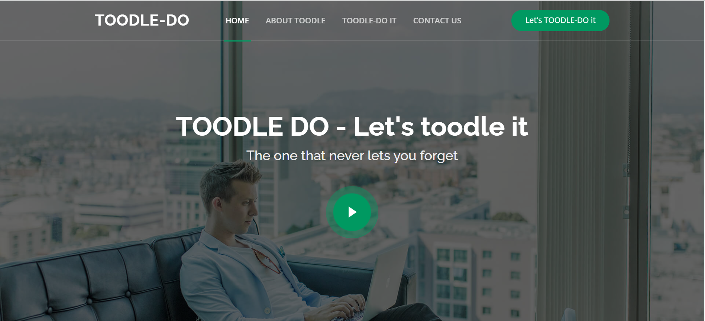

# TOODLE-DO : The one that never let's you forget



## Requirements

- Python (version 3.5 and above)

## LAUNCHING TOODLE-DO

1. Cloning the project

```
$ git clone git@github.com:goby-lang/sample-web-app.git
```
2. Open the project in any IDE Eg: VS CODE.
3. Launch the application!

## LAUNCHING ROGER
1. Cloning the project

```
$ git clone git@github.com:goby-lang/sample-web-app.git
```
3. Install python (compatible with python 3.5 version and above)
2. Open the speechtotext.py file in any IDE Eg: PyCharm
3. Run and talk with Roger - Your very own voice assistant


## Contributors
Creators of TOODLE-DO

- Samridhi Kapoor
- Devyanshi Ahuja
- Ekta
